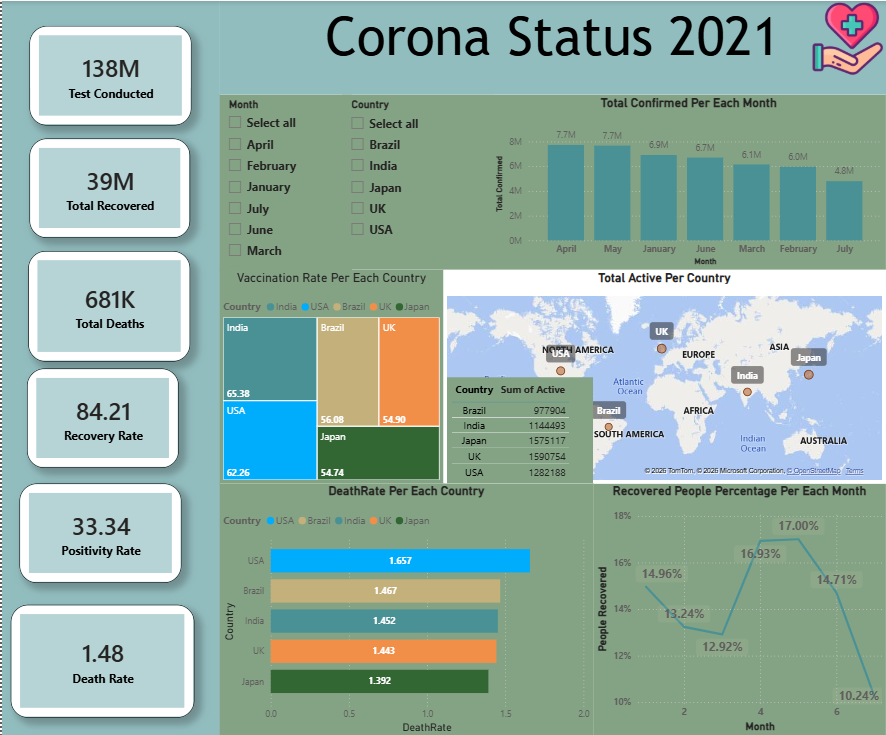

# COVID-19 Statistics Dashboard — Project Overview

## Summary

This project takes a raw COVID-19 statistics dataset (200 rows covering 5 countries/regions from January to July 2021), cleans and prepares it using Python, then builds an interactive dashboard in Power BI to visualize case trends, recovery rates, death rates, testing volume, and vaccination rates.

## Tools Used

- **Python (pandas)** — data cleaning, validation, and feature engineering
- **Power BI Desktop** — data modeling (star schema) and dashboard visualization

## Step-by-Step Process

### 1. Initial Data Inspection
Loaded the raw CSV (`COVID19_Statistics_200_Rows.csv`) and checked for:
- Missing values
- Duplicate rows and duplicate `Record_ID`s
- Data types for each column
- Whether `Active` correctly equaled `Confirmed − Recovered − Deaths`

### 2. Identifying a Data Quality Issue
Found 10 rows where `Recovered + Deaths` exceeded `Confirmed` — a logical impossibility, since you can't have more recoveries/deaths than confirmed cases. In every one of these rows, `Active` had been recorded as `0`, which masked the underlying inconsistency.

### 3. Cleaning: Removing Invalid Rows
Rather than patch the `Active` column (which would have produced negative, meaningless values), we flagged and **excluded these 10 rows entirely**, since the source values for `Confirmed`, `Recovered`, or `Deaths` in those rows couldn't be trusted. This brought the dataset from 200 rows down to **190 valid rows**.

```python
invalid_mask = (df['Recovered'] + df['Deaths']) > df['Confirmed']
df_clean = df[~invalid_mask].copy()
```

### 4. Splitting the Date Column
Converted the `Date` column to a proper datetime type, then extracted:
- `Year`
- `Month` (numeric, 1–12, for correct sorting)
- `Day`
- `Month_Name` (text version, e.g. "January", for readable labels)

```python
df_clean['Date'] = pd.to_datetime(df_clean['Date'])
df_clean['Year'] = df_clean['Date'].dt.year
df_clean['Month'] = df_clean['Date'].dt.month
df_clean['Day'] = df_clean['Date'].dt.day
df_clean['Month_Name'] = df_clean['Date'].dt.month_name()
```

### 5. Final Validation
Re-checked the cleaned dataset to confirm:
- `Active` now matches `Confirmed − Recovered − Deaths` for all 190 rows
- No duplicates, no nulls, no negative values
- `Vaccination_Rate_%` stays within a valid 0–100 range
- `Month` and `Month_Name` are consistent with each other

### 6. Exporting for Power BI
Saved the cleaned dataset as `COVID19_Statistics_Cleaned.csv`, ready to import.

### 7. Data Modeling in Power BI
Built a **star schema**:
- **Fact table**: the cleaned COVID data (measures: Confirmed, Recovered, Deaths, Active, Tests_Conducted, Vaccination_Rate_%)
- **DimDate**: a full calendar table built with DAX `CALENDAR()`, containing Date, Year, Month, MonthName — avoids gaps in the raw scattered dates and enables proper time-based sorting/filtering
- **DimRegion**: a deduplicated Country/State table

Relationships were set as **One-to-Many** (dimension → fact) with **Single** cross-filter direction, and `Month_Name` was sorted by the numeric `Month` column to display months in calendar order rather than alphabetically.

### 8. Building the Dashboard
Created a dashboard ("Corona Status 2021") featuring:
- **KPI cards**: Total Confirmed, Total Recovered, Total Deaths, Total Active, Recovery Rate %, Death Rate %, Positivity Rate %
- **Slicers**: Month and Country
- **Bar chart**: Total Confirmed per month
- **Map + table**: Total Active cases per country (table added alongside the map since Power BI's standard map visual can't display always-visible value labels — only tooltips on hover)
- **Treemap**: Average Vaccination Rate per country
- **Bar chart**: Death Rate per country
- **Line chart**: Recovered People Percentage per month

## Key Metrics Calculated
- **Recovery Rate %** = Recovered ÷ Confirmed × 100
- **Death (Fatality) Rate %** = Deaths ÷ Confirmed × 100
- **Positivity Rate %** = Confirmed ÷ Tests_Conducted × 100
- **Average Vaccination Rate %** per country

## Result
A cleaned, validated 190-row dataset and an interactive Power BI dashboard that lets users filter by month and country to explore confirmed cases, recovery/death rates, testing volume, active cases by region, and vaccination coverage.


## Dashboard Preview

